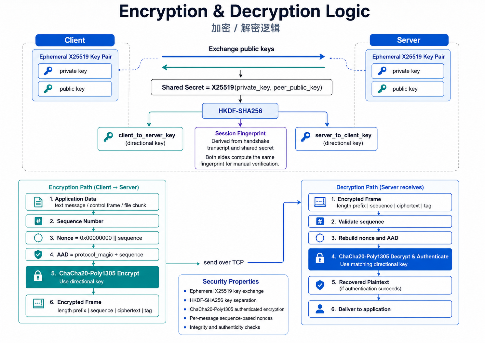
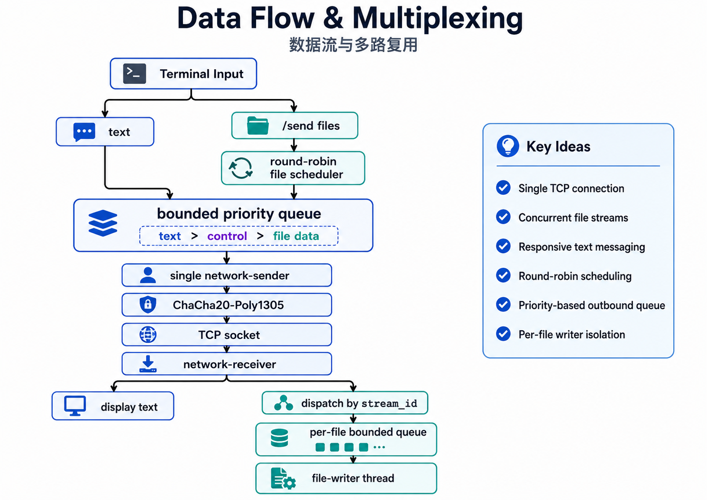

[English](README.md) | **简体中文**

# 🔐 XFM4 SecureMux

[](https://www.python.org/)
[](#-xfm4-协议逻辑)
[](#-加密工作流程)
[](#-开源许可证)

XFM4 SecureMux 是一个基于 Python 的双向加密通信工具。在一条 TCP 连接上，它可以同时传输文本消息和多个大文件，并使用逻辑流多路复用、分块传输、优先级队列和多线程模型保持通信响应性。

项目仓库：<https://github.com/wangyifan349/xfm4-secure-mux>

## ✨ 核心能力

- 🔑 使用临时 X25519 密钥对建立每次连接独立的共享秘密
- 🧬 使用 HKDF-SHA256 派生客户端发送密钥、服务器发送密钥和会话指纹材料
- 🔒 使用 ChaCha20-Poly1305 对握手后的每个应用协议包执行认证加密
- 🧭 双方显示相同的会话指纹，可通过独立可信渠道进行人工核对
- 💬 文件传输期间可以继续双向发送和显示文本消息
- 📦 大文件按固定大小分块读取，不会一次性载入内存
- 🛣️ 多个文件通过独立 `stream_id` 在同一 TCP 连接上交错传输
- 🔄 客户端与服务器可以同时发送文件、接收文件和收发消息
- ⚡ 文本和控制包优先于文件数据包
- 🧵 单独的网络发送线程、网络接收线程、文件调度线程和文件写入线程
- ✅ 文件接收完成后校验总大小和 SHA-256，并向发送方返回确认包
- 🧯 支持取消本端文件发送任务
- 🗂️ 自动处理接收文件重名、临时文件和文件名净化

## 📁 项目结构

```text
xfm4-secure-mux/
├── secure_mux_server.py         # XFM4 服务端
├── secure_mux_client.py         # XFM4 客户端
├── README.md                    # English documentation
├── README.zh-CN.md              # 中文文档
├── encryption-decryption-flow.png      # 加密 / 解密流程图
└── data-flow-multiplexing.png    # 数据流 / 多路复用流程图
```

## 🖼️ 架构图

### 加密与解密逻辑



### 数据流与多路复用



## 📋 环境要求

- Python 3.9 或更高版本
- `cryptography`
- 支持 TCP Socket 和线程的操作系统

直接安装依赖，不需要创建虚拟环境：

```bash
python -m pip install --upgrade cryptography
```

## 🚀 快速开始

### 1. 克隆项目

```bash
git clone https://github.com/wangyifan349/xfm4-secure-mux.git
cd xfm4-secure-mux
```

### 2. 启动服务器

```bash
python secure_mux_server.py --host 0.0.0.0 --port 9000 --download-dir server_downloads
```

服务器默认监听所有 IPv4 网络接口的 `9000` 端口，并将收到的文件保存到 `server_downloads`。

### 3. 启动客户端

本机连接：

```bash
python secure_mux_client.py 127.0.0.1 --port 9000 --download-dir client_downloads
```

局域网连接示例：

```bash
python secure_mux_client.py 192.168.1.10 --port 9000 --download-dir client_downloads
```

连接成功后，双方都会显示同一个会话指纹：

```text
加密会话已建立，会话指纹: 17D9-4AB9-77C4-DBB1-83EA-53EF-067B-999B-1CF0-F967
```

双方可以在发送重要数据前，通过语音、面对面或既有可信通信渠道核对该指纹。

### 4. 发送文本消息

连接建立后，直接输入文本并回车：

```text
客户端> hello
```

文件传输过程中仍可继续输入和接收文本消息。

### 5. 发送一个文件

```text
/send ./example.zip
```

### 6. 并发发送多个文件

```text
/send ./video.mp4 ./archive.zip ./backup.iso
```

路径包含空格时使用引号：

```text
/send "./large files/video one.mp4" "./large files/video two.mp4"
```

每个文件会获得独立的 `stream_id`，文件调度器按轮询方式推进这些文件流，而不是等待前一个文件完全发送后再处理下一个文件。

## ⌨️ 交互命令

| 命令 | 作用 |
|---|---|
| `<文本>` | 发送一条加密文本消息 |
| `/send <文件1> [文件2 ...]` | 将一个或多个普通文件加入发送队列 |
| `/transfers` | 查看发送、接收和最近完成记录 |
| `/cancel <stream_id>` | 取消本端发送任务，支持十进制或 `0x` 十六进制 |
| `/fingerprint` | 再次显示当前会话指纹 |
| `/help` | 显示内置命令帮助 |
| `/quit` | 关闭当前连接并退出 |

示例：

```text
/transfers
/fingerprint
/cancel 0x1
```

`/cancel` 针对本端发起的发送流。取消后，本端会停止排队该流的文件数据，并向对端发送 `FILE_CANCEL` 控制包。

## ⚙️ 命令行参数

### 服务端

```text
python secure_mux_server.py [--host HOST] [--port PORT]
                            [--download-dir DIRECTORY]
                            [--chunk-size-kib SIZE]
```

| 参数 | 默认值 | 说明 |
|---|---:|---|
| `--host` | `0.0.0.0` | TCP 监听地址 |
| `--port` | `9000` | TCP 监听端口 |
| `--download-dir` | `server_downloads` | 接收文件保存目录 |
| `--chunk-size-kib` | `256` | 本端发送文件的分块大小，范围为 4–1024 KiB |

当前服务端一次处理一个客户端。当前连接关闭后，服务器继续接受下一个客户端连接。

### 客户端

```text
python secure_mux_client.py [host] [--port PORT]
                            [--download-dir DIRECTORY]
                            [--chunk-size-kib SIZE]
```

| 参数 | 默认值 | 说明 |
|---|---:|---|
| `host` | `127.0.0.1` | 服务器地址 |
| `--port` | `9000` | 服务器端口 |
| `--download-dir` | `client_downloads` | 接收文件保存目录 |
| `--chunk-size-kib` | `256` | 本端发送文件的分块大小，范围为 4–1024 KiB |

分块大小是发送方属性。双方可以使用不同的 `--chunk-size-kib`，接收端会从每个 `FILE_START` 包中读取对应文件流的分块大小。

## 🔐 加密工作流程

### 1. TCP 连接

客户端首先建立普通 TCP 连接。TCP 负责可靠、有序的字节传输；XFM4 在 TCP 之上增加消息边界、加密、逻辑流和文件传输状态。

### 2. 临时 X25519 握手

每次建立连接时，客户端和服务器都会生成新的临时 X25519 密钥对。私钥只保存在当前进程内存中，不写入文件。

握手顺序：

```text
Client                                              Server
  │                                                    │
  │  PROTOCOL_MAGIC "XFM4" + Client X25519 Public Key │
  ├───────────────────────────────────────────────────>│
  │                                                    │
  │  PROTOCOL_MAGIC "XFM4" + Server X25519 Public Key │
  │<───────────────────────────────────────────────────┤
  │                                                    │
  │  X25519(client_private, server_public)             │
  │  X25519(server_private, client_public)             │
  │                                                    │
  │          Both sides obtain the same secret         │
```

握手公钥包使用 4 字节长度前缀进行分帧。握手完成前尚未建立会话密钥，因此这两个公钥交换帧不使用 ChaCha20-Poly1305。

### 3. HKDF-SHA256 密钥派生

双方构造相同的握手记录：

```text
transcript = "XFM4" || client_public_key || server_public_key
```

随后计算：

```text
transcript_hash = SHA-256(transcript)
HKDF-SHA256(
    input_key_material = X25519 shared secret,
    salt               = transcript_hash,
    info               = "xfm4/x25519/chacha20poly1305/session-v1",
    output_length      = 96 bytes
)
```

96 字节输出被拆分为：

```text
0..31   Client -> Server ChaCha20-Poly1305 key
32..63  Server -> Client ChaCha20-Poly1305 key
64..95  Session fingerprint key material
```

两个传输方向使用不同的 256 位密钥，因此客户端发送方向和服务器发送方向拥有独立的密钥空间、序号空间和 nonce 空间。

### 4. 会话指纹

会话指纹由握手记录和 HKDF 派生出的指纹材料计算：

```text
SHA-256(
    "xfm4/session-fingerprint/v1"
    || transcript
    || fingerprint_key
)
```

程序取摘要前 40 个十六进制字符，转换为大写，并按每 4 个字符分组显示。由于双方使用相同的握手记录、共享秘密和 HKDF 参数，因此应独立得到相同的指纹。

只有在双方看到完全一致的指纹，并通过独立可信渠道完成核对时，指纹校验才算完成。可以随时输入 `/fingerprint` 重新查看。

### 5. ChaCha20-Poly1305 加密帧

握手完成后，文本、文件元数据、文件分块、取消通知和完成确认都会作为 XFM4 应用协议包加密。

每个方向维护一个从 `0` 开始的 64 位无符号递增序号：

```text
nonce = 0x00000000 || uint64_be(sequence_number)
AAD   = "XFM4" || uint64_be(sequence_number)
```

ChaCha20-Poly1305 使用：

- 32 字节方向密钥
- 12 字节 nonce
- XFM4 协议标识和序号作为 AAD
- 16 字节认证标签

序号本身位于密文外部，但被 AAD 认证。接收端只接受与预期值完全相同的下一个序号，然后才执行解密。认证失败、序号异常或协议长度异常都会终止当前连接。

### 6. 加密帧结构

TCP 中的握手后帧结构：

```text
+----------------------+------------------------------------------+
| 4 bytes              | encrypted frame length, uint32 big-endian|
+----------------------+------------------------------------------+
| 8 bytes              | sequence number, uint64 big-endian       |
+----------------------+------------------------------------------+
| variable             | ChaCha20 ciphertext                      |
+----------------------+------------------------------------------+
| 16 bytes             | Poly1305 authentication tag              |
+----------------------+------------------------------------------+
```

4 字节帧长度和 8 字节序号不是机密字段。应用协议包的类型、`stream_id`、文本内容、文件名、文件大小、文件块、SHA-256 和控制消息均位于认证加密区域内。

## 🛣️ XFM4 协议逻辑

解密后的应用协议包统一使用以下头部：

```text
+----------------------+------------------------------------------+
| 1 byte               | packet_type                              |
+----------------------+------------------------------------------+
| 8 bytes              | stream_id, uint64 big-endian             |
+----------------------+------------------------------------------+
| variable             | packet-specific payload                  |
+----------------------+------------------------------------------+
```

### 数据包类型

| 类型 | 值 | 用途 |
|---|---:|---|
| `TEXT` | `0x01` | UTF-8 文本消息 |
| `FILE_START` | `0x10` | 声明文件名、文件大小和分块大小 |
| `FILE_CHUNK` | `0x11` | 携带文件偏移和文件数据 |
| `FILE_END` | `0x12` | 声明最终大小和 SHA-256 摘要 |
| `FILE_CANCEL` | `0x13` | 取消文件流并携带原因 |
| `FILE_ACK` | `0x14` | 返回接收成功或失败状态 |

### stream_id 分配

```text
stream_id = 0              文本消息
stream_id = 1, 3, 5, ...   客户端发起的文件流
stream_id = 2, 4, 6, ...   服务器发起的文件流
```

奇偶分区使双方可以同时创建文件流，而不需要先请求一个集中式流编号。接收端会检查对端的 `stream_id` 奇偶性，拒绝非法或冲突的文件流。

## 📦 文件传输工作流程

### FILE_START

发送方首先发送文件元数据：

```text
uint64  declared_file_size
uint32  chunk_size
uint16  filename_size
bytes   UTF-8 filename
```

接收方会：

1. 校验 `stream_id`、文件名长度和分块大小。
2. 净化文件名，只保留安全的基础文件名。
3. 在下载目录中选择不冲突的最终文件名。
4. 创建 `.part` 临时文件路径。
5. 为该文件流启动独立的写入线程和有界写入队列。

### FILE_CHUNK

每个文件块包含：

```text
uint64  absolute_file_offset
bytes   chunk_data
```

接收方要求：

- 偏移必须等于该流当前期望偏移。
- 数据块不能超过 `FILE_START` 中声明的分块大小。
- 数据块结束位置不能超过声明的文件总大小。

验证通过后，网络接收线程把数据块放入该文件流的写入队列，由对应的文件写入线程顺序落盘并更新 SHA-256。

### FILE_END

发送方读取完整个文件后发送：

```text
uint64  total_file_size
bytes   SHA-256 digest, 32 bytes
```

接收方等待已入队的数据全部写入，然后验证：

- `FILE_START`、实际接收偏移和 `FILE_END` 的总大小一致。
- 实际写入大小与声明大小一致。
- 本地计算的 SHA-256 与发送方摘要一致。

验证成功后，接收端执行以下操作：

1. `flush()` 文件缓冲区。
2. 使用 `fsync()` 请求操作系统同步文件数据。
3. 关闭临时文件。
4. 使用 `os.replace()` 将 `.part` 文件原子移动为最终文件名。
5. 发送成功 `FILE_ACK`，附带接收端计算的 SHA-256 和最终文件名。

发送方只有收到状态成功且 SHA-256 相同的 `FILE_ACK` 后，才将该文件流标记为 `complete`。

### FILE_CANCEL 与 FILE_ACK

`FILE_CANCEL` 携带 UTF-8 原因，用于停止指定文件流。`FILE_ACK` 包含：

```text
uint8   status               # 0 = success, 1 = failure
bytes   SHA-256, 32 bytes
uint16  message_size
bytes   UTF-8 message
```

失败 ACK 中的消息通常包含写盘错误或校验失败原因。

## 🧵 并发与多路复用工作流程

每个连接包含以下执行单元：

| 执行单元 | 代码线程名称 | 职责 |
|---|---|---|
| 主线程 | — | 接收终端输入，处理命令并提交文本或文件任务 |
| 网络发送线程 | `network-sender` | 独占 socket 写操作，按优先级发送所有加密包 |
| 网络接收线程 | `network-receiver` | 读取、校验、解密并按包类型和 `stream_id` 分发 |
| 文件调度线程 | `file-scheduler` | 轮询待发送文件流，每次推进一个流的一步 |
| 文件写入线程 | `file-writer-<stream_id>` | 每个接收文件一个线程，负责落盘和 SHA-256 计算 |

整体数据流：

```text
Terminal input
    │
    ├── text ───────────────────────────────────────┐
    │                                               │
    └── /send files ──> round-robin file scheduler │
                                                    ▼
                                      bounded priority queue
                                  text > control > file data
                                                    │
                                                    ▼
                                      single network-sender
                                                    │
                                      ChaCha20-Poly1305
                                                    │
                                                    ▼
                                               TCP socket
                                                    │
                                                    ▼
                                         network-receiver
                                                    │
                          ┌─────────────────────────┴──────────────┐
                          ▼                                        ▼
                    display text                         dispatch by stream_id
                                                                   │
                                                                   ▼
                                                    per-file bounded queue
                                                                   │
                                                                   ▼
                                                        file-writer thread
```

### 为什么只允许一个线程写 socket

多个线程直接调用 `sendall()` 会使协议序号管理、优先级和错误处理变得复杂。XFM4 将所有出站包统一放入一个优先级队列，并让 `network-sender` 成为唯一执行加密和写 socket 的线程，从而保证：

- 发送序号严格递增。
- 单个加密帧不会与其他线程的数据交叉。
- 文本和控制消息能够优先发送。
- 连接错误只需要从一个发送入口统一上报。

### 文件轮询调度

文件调度器维护活动文件流队列。每次取出一个 `stream_id` 后，只执行一步：

- 尚未开始：发送 `FILE_START`。
- 正在发送：读取并排队一个文件块。
- 文件读取完成：发送 `FILE_END` 并等待 ACK。

仍需继续发送的流被放回调度队列尾部。因此多个大文件的数据块会交错进入网络发送队列，实现单连接上的逻辑并发。

### 消息优先级

内部优先级数值越小，发送越优先：

```text
TEXT       priority 0
CONTROL    priority 1
FILE DATA  priority 10
```

当有界发送队列已满时，文本、控制和文件提交者都可能短暂等待空位；一旦进入队列，文本和控制包会优先于尚未发送的文件数据包。已经进入操作系统 TCP 缓冲区的数据不能被后来的消息越过。

### 背压与内存控制

- 网络发送优先级队列最多保存 64 个包。
- 每个接收文件的写入队列最多保存 32 个任务。
- 文件发送端每次只读取一个分块。
- 接收端同时最多维护 64 个活动文件接收流。

当网络发送或磁盘写入速度较慢，生产线程会在有界队列上等待，而不是无限读取文件并持续占用内存。

## 📏 协议限制

| 项目 | 当前值 |
|---|---:|
| 协议标识 | `XFM4` |
| X25519 公钥 | 32 bytes |
| ChaCha20-Poly1305 密钥 | 32 bytes / direction |
| ChaCha20-Poly1305 nonce | 12 bytes |
| Poly1305 tag | 16 bytes |
| 序号 | 64-bit / direction |
| TCP 加密帧最大长度 | 8 MiB |
| 单条文本最大 UTF-8 大小 | 1 MiB |
| 默认文件分块 | 256 KiB |
| 文件分块可配置范围 | 4–1024 KiB |
| 文件名最大 UTF-8 大小 | 4096 bytes |
| 同时活动的接收文件流 | 最多 64 |
| 服务端并发客户端 | 1 |

当前实现不包含断点续传。正常取消或正常关闭连接时，文件写入线程会尝试删除未完成的 `.part` 临时文件；如果进程被强制终止，下载目录中可能残留 `.part` 文件。重新连接后需要重新发送对应文件。

## 🗂️ 文件保存规则

- 服务端默认保存到 `server_downloads`。
- 客户端默认保存到 `client_downloads`。
- 目录不存在时自动创建。
- 远端路径信息不会被直接使用，只采用净化后的文件基础名称。
- 同名文件自动改名为 `name (1).ext`、`name (2).ext` 等。
- 校验完成前使用隐藏式 `.part` 临时文件。
- 只有通过大小和 SHA-256 校验后才生成最终文件。

## 🔧 常见使用示例

指定端口和 512 KiB 分块启动服务器：

```bash
python secure_mux_server.py \
  --host 0.0.0.0 \
  --port 9443 \
  --download-dir ./received/server \
  --chunk-size-kib 512
```

连接该服务器：

```bash
python secure_mux_client.py 192.168.1.10 \
  --port 9443 \
  --download-dir ./received/client \
  --chunk-size-kib 512
```

发送多个文件并继续聊天：

```text
/send "./release/app.tar.gz" "./release/database backup.sql"
客户端> 两个文件已经开始发送
/transfers
```

## 💖 赞助项目

如果 XFM4 SecureMux 对你有帮助，可以通过 Bitcoin 支持项目维护：

```text
bc1qymelsaghkfw992ee2tyzz0ph8xcy33u3gs7jl5
```

请在转账前自行核对地址。链上交易通常不可撤销。

## 📜 开源许可证

本项目以 GNU Affero General Public License v3.0 only（`AGPL-3.0-only`）发布。

你可以在 AGPL-3.0 条款下使用、复制、修改和分发本项目。发布修改版本或通过网络向用户提供修改后的程序功能时，应遵守 AGPL-3.0 对源代码提供和许可证保留的要求。完整条款以 GNU 官方 AGPL-3.0 文本为准：<https://www.gnu.org/licenses/agpl-3.0.html>

建议在 GitHub 仓库根目录同时放置完整的 `LICENSE` 文件，并在源代码文件头保留相应的版权与 SPDX 标识。

## 🤝 参与贡献

欢迎提交 Issue 和 Pull Request：

<https://github.com/wangyifan349/xfm4-secure-mux>

提交协议变更时，请同步更新：

- `PROTOCOL_MAGIC`
- 握手 transcript 和 HKDF `info`
- 数据包格式与类型编号
- 客户端和服务器的解析逻辑
- README 中的协议说明

客户端和服务器必须使用兼容的协议版本、包格式和密钥派生参数，否则握手或后续协议解析会失败。
